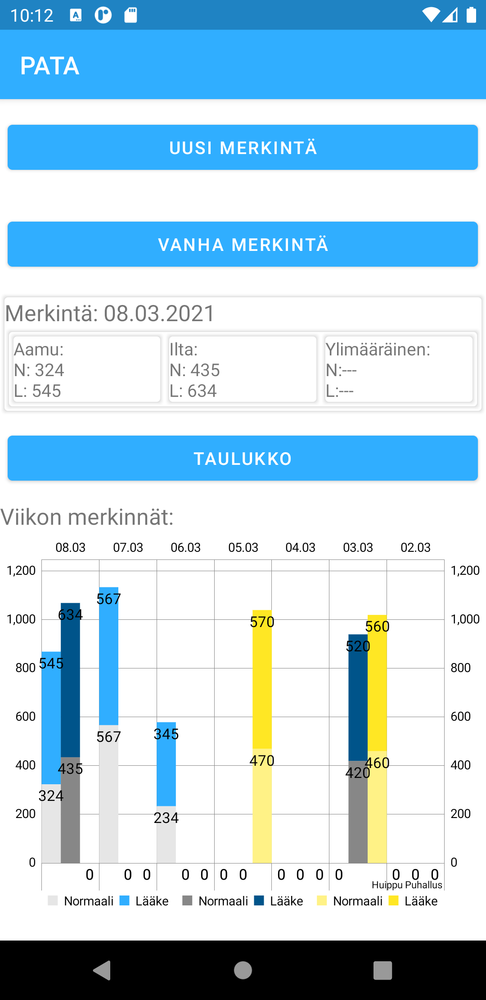
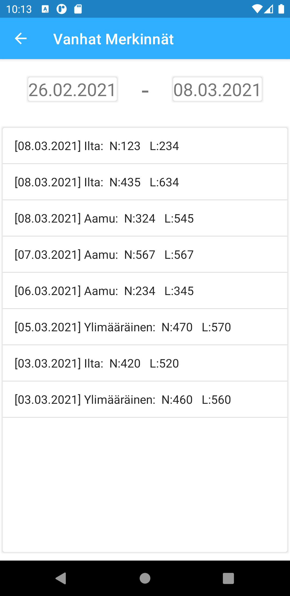
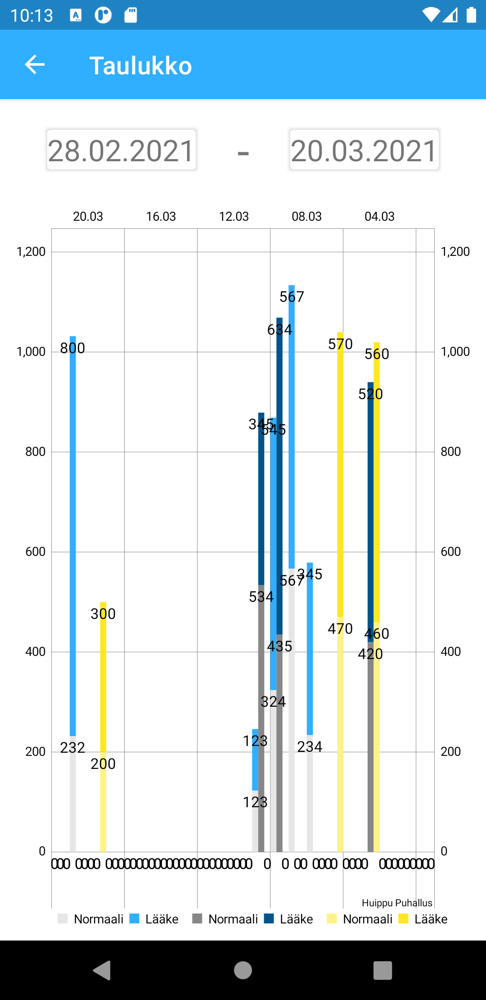

# AndroidProject: Pata

## PATA: Pef -mittauksen ApuTyökalu App

PATA sovelluksella tuodaan Pef -mittausten kirjaaminen nykyaikaan. Voit sanoa hyvästit paperisille Pef -mittaus taulukoille ja toivottaa tervetuleeksi kätevän mobiilisovelluksen.
PATA tarjoaa helpon käyttöliittymän merkintöjen luontiin, muokaamiseen ja tutkimiseen taulukoiden muodossa.

PATA tekee automaattisesti pieniä helpotuksia käyttäjälle. Uuden puhalluksen merkitsemisessä sovellus valitsee kellonajan mukaan onko kyseessä ilta vai aamu merkintä. Käyttäjällä on mahdollisuus vaihtaa niin merkinnän ajankohtaa kuin päivämäärää tarpeen vaatiessa. Taulukot täyttyvät automaattisesti kirjattujen puhallusten huippu arvoilla.

PATA:n hyvin yksinkertaisen käyttöliitymän ansiosta melkein kuka vain osaa käyttää sovellusta. Päävalikossa näkyy päivän puhallusten arvot, joista on helppo tarkastaa onko unohtunut merkitä puhallus tälle päivälle. Päävalikon taulukko näyttää 7-päivän ajalta merkintöjen huippu arvot. 

Pef -mittauksien kirjaaminen ei ole ollut koskaan aikaisemmin näin helppoa ja nopeaa!

### Käytetyt kirjastot:
- [MPAndroidChart](https://github.com/PhilJay/MPAndroidChart) by [PhilJay](https://github.com/PhilJay).
- [Gson](https://github.com/google/gson) by [Google](https://github.com/google)

### IDE - Ohjelmointiympäristö:
- [Android Studio](https://developer.android.com/studio)

### Android SDK:
- API 30

### Kuvakaapaukset päänäkymistä:
:

## Tekijät:
- Leevi Koskinen
- Peetu Salonen
- Janne Lähteenmäki

Projekti on suoritettu osana [Metropolian](https://www.metropolia.fi) amk tutkintoa, 1.vuoden kursilla: Mobiilit terveyssovellukset.

Sovelluksen kehitystyö ei enään jatku meidän osalta.

 

